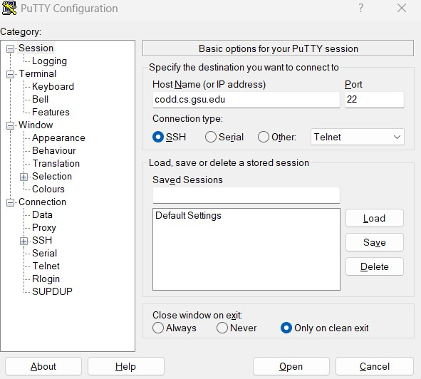
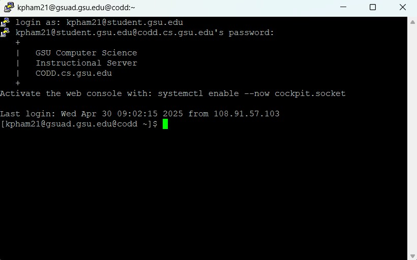

## Table of Contents

- [Description](#wp-gameoflife)
- [Authors](#authors)
- [Project Structure](#project-structure)
- [Instructions](#instructions-to-build-and-run)

# WP-gameoflife

The Game of Life involves a grid of cells where each cell has one of two states: alive or dead. The basic premise revolves around an “initial configuration” that “evolves” through time based on its neighbors (8 adjacent cells) via these mathematical rules:

- A live cell with fewer than two live neighbors dies (underpopulation)
- A live cell with more than three live neighbors dies (overpopulation)
- A live cell with two or three live neighbors lives on to the next generation
- A dead cell with exactly three live neighbors becomes a live cell

# AUTHORS

KENNY PHAM  
STEVEN PHAN  
LAW REH

## PROJECT STRUCTURE

```
WP-gameoflife/
├── frontend/
    └── src/
        └── assets/ -- External images/icons, etc. (if applicable)
        └── components/ -- Reusable React components
        └── styles/ -- ALL stylesheets; both modular and for page displays
├── backend/
    └── admin
        └── api -- API endpoints for managing users' sessions, stats, and accounts
    └── api -- API endpoints for session management
        └── user
    └── auth -- Registration/Login backend logic
    └── config -- Database connection configuration
    └── includes -- Helper/utility functions
```

frontend/:

- CSS/JS
- React bootstrapped with Vite for initialization
- Contains all of our UI/UX implementation
- Tailwind CSS for ease of modern styling
- [React Router](https://reactrouter.com/6.29.0/start/overview) for Routing

> [!NOTE]
> Most frontend implementation will be done within the src/ folder. assets/ for external images, components/ for reusable UI components, and styles/ for our stylesheets.
> App.jsx is the root application file. It is used for global configuration (global stylesheet), or for global components (i.e., headers, footers, sidebars, etc.)
> As we will only have a few (maybe 3-4) separate pages, I am opting to not include a pages/ folder--we will just create our pages within the src/ dir.

backend/:

- PHP
- Contains backend logic for form validation, user authentication, and communication with the database

database/:

- SQL (MySQL)

# Instructions to Build and Run

Prerequisites:

- [Node.js](https://docs.npmjs.com/cli/v11/configuring-npm/install)
- NPM (Node Package Manager; comes with Node.js)
- [MySQL](https://dev.mysql.com/downloads/installer/)

As our build directories are ignored by convention via .gitignore, whenever you pull changes from the repository that include additions to project dependencies, you should run:

1. Install NPM packages within the terminal to install new dependencies

```
npm install
```

2. Connect to the database server (via PuTTY or whichever console/terminal you prefer)

   Connect to the CODD server within your PuTTY Configuration:
   

   Login to your CODD account as you would in whatever software you use for FTP:
   

   Run these commands in sequence:

```
mysql -u kpham21 -p

kpham21

USE kpham21;
```

> [!NOTE]
> Our database is currently configured to run on my provided MariaDB server using the MySQLi extension for PHP support. Our professor, Louis Henry, provided each of us an account to access our own MariaDB servers. With that said, our localhost development servers CANNOT access the database unless we transfer our project files into our pertinent CODD directories. As such, I have my project within my CODD directory. If you want to make changes that involve database interactions, then those need to be updated within my CODD directory as well. Reach out to me if that is the case. There are other, easier and hassle-free alternatives, but this is what the professor provided for us.

3. Start Node development server (for testing/demo)

```
cd frontend

npm run dev
```

4. Start PHP development server
   > [!NOTE]
   > The PHP server should run on a different port from your frontend. If the frontend is also running on port :8000, then change your php local port.

```
cd backend

php -S localhost:8000
```

> [!NOTE]
> Both servers need to be running simultaneously to test the full-stack implementation of the project. If you just run "npm run dev," you will only be testing the frontend.
> Developers typically use PHP servers to serve the PHP files rather than the built-in PHP server (like above); we could as well if you guys desire
